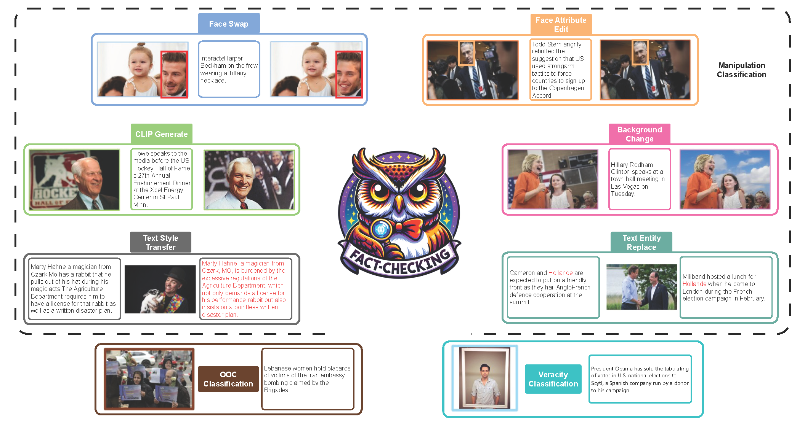
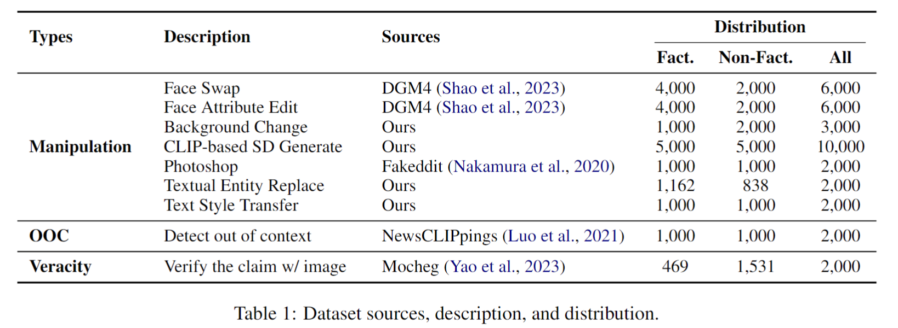
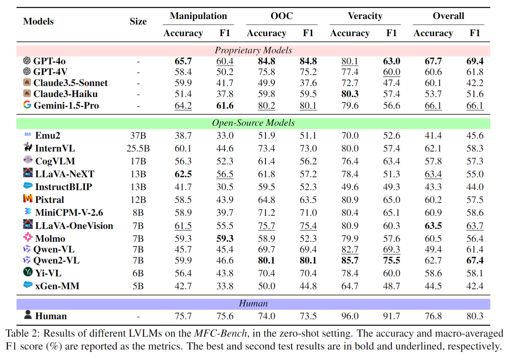
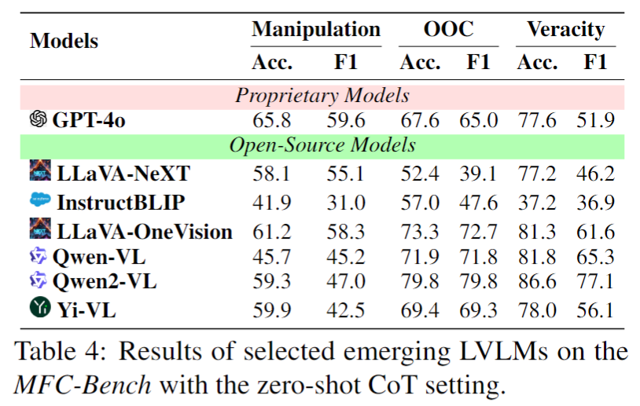

#  MFC-Bench
[](https://arxiv.org/abs/2406.11288)
[](https://www.apache.org/licenses/LICENSE-2.0)

<div align="center">

</div>


## :bookmark_tabs: Introduction
We introduce the MFC-Bench, a comprehensive Multimodal FactChecking testbed designed to evaluate LVLM in terms of identifying factual inconsistencies and
counterfactual scenarios.
MFC-Bench encompasses a wide range of visual and textual queries,
organized into three binary classification tasks: Manipulation Classification, Out-of-Context Classification, and Veracity Classification.  
1) The Manipulation Classification task targets various
alterations like face swapping, face attribute editing, background changing, image generation, entity
replacement, and style transfer. (Dataset:[manipulation-mfc-bench](https://huggingface.co/datasets/Anonymous-2024/manipulation-mfc-bench))
2) The Out-of-Context Classification task focuses on identifying the
false connection between the image and text that may be both true.(Dataset:[ooc-mfc-bench](https://huggingface.co/datasets/Anonymous-2024/ooc-mfc-bench))
3) The Veracity Classification task
is the multimodal counterpart to classifying the veracity of textual claims given the visual evidence, by
leveraging the inherent knowledge embedded in LVLMs.(Dataset:[veracity-mfc-bench](https://huggingface.co/datasets/Anonymous-2024/veracity-mfc-bench))

## :dart: Datasets Construction
<div align="center">

</div>


## :mag: Methodology
To provide an exhaustive perspective on the current state of LVLMs within the context of multimodal
fact-checking, we conducted evaluations on 18 representative accessible LVLMs. For the open-source and accessible LVLMs, we adopt the representative models like 
[Emu2](https://github.com/baaivision/Emu),
[InternVL](https://github.com/OpenGVLab/InternVL), 
[CogVLM](https://github.com/THUDM/CogVLM), 
[LLaVA-NeXT](https://github.com/haotian-liu/LLaVA/blob/main/docs/MODEL_ZOO.md#llava-v16), 
[InstructBLIP](https://github.com/salesforce/LAVIS/tree/main/projects/instructblip), 
[Pixtral](https://mistral.ai/news/pixtral-12b/),
[MiniCPM-V-2.6](https://huggingface.co/openbmb/MiniCPM-V-2_6),
[LLaVA-OneVision](https://github.com/LLaVA-VL/LLaVA-NeXT/blob/main/docs/LLaVA_OneVision.md),
[Molmo](https://huggingface.co/allenai/Molmo-7B-D-0924),
[Qwen-VL](https://github.com/QwenLM/Qwen-VL),
[Qwen2-VL](https://github.com/QwenLM/Qwen2-VL),
[Yi-VL](https://github.com/01-ai/Yi) and 
[xGen-MM](https://huggingface.co/Salesforce/xgen-mm-phi3-mini-instruct-r-v1).

As five of the most powerful closed-source LVLMs,
[GPT-4o](https://openai.com/index/hello-gpt-4o/), 
[GPT-4V](https://openai.com/index/gpt-4v-system-card/),
[Claude3.5-Sonnet](https://www.anthropic.com/news/claude-3-5-sonnet),
[Claude3-Haiku](https://www.anthropic.com/news/claude-3-haiku) and
[Gemini-1.5-Pro](https://blog.google/technology/ai/google-gemini-next-generation-model-february-2024/). 
are also included in our testing scope.

To explore the effect of different prompt strategies like Chain-of-Thought
(CoT)  or In-Context Learning (ICL) prompting, we utilized the four following
prompt methods for the MFC-Bench: Zero-shot, Zero-shot with CoT , Few-shot,
and Few-shot with CoT.

<div align="center">

</div>

## :flashlight: Experiment Results
### 1. Zero-Shot
<div align="center">

</div>

### 2. Model Interpretability
The model's justification was evaluated by GPT-4 and Human subjects across four dimensions: **Misleadingness (M)**, **Informativeness (I)**, **Soundness (S)**, and **Readability (R)**. A 5-point Likert scale was used, where 1 indicates the lowest quality and 5 the highest for Informativeness, Soundness, and Readability, but the scale is reversed for Misleadingness.
<div align="center">

</div>

### 3. Zero-Shot with CoT 
<div align="center">

</div>


### 4. Few-Shot
<div align="center">

</div>


## Citation
If you find our paper and code useful in your research, please consider giving a star :star: and citation :pencil: :)

```BibTeX
@misc{wang2024mfcbenchbenchmarkingmultimodalfactchecking,
      title={MFC-Bench: Benchmarking Multimodal Fact-Checking with Large Vision-Language Models}, 
      author={Shengkang Wang and Hongzhan Lin and Ziyang Luo and Zhen Ye and Guang Chen and Jing Ma},
      year={2024},
      eprint={2406.11288},
      archivePrefix={arXiv},
      primaryClass={cs.CL},
      url={https://arxiv.org/abs/2406.11288}, 
}
```


